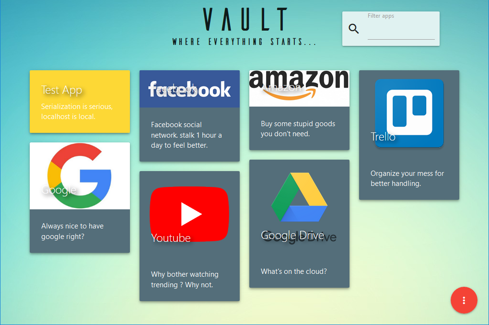

# README

Vault is a pure vanillaJS + PHP landing page for your server.
It uses a CMS-approach, where zero knowledge is needed to deploy the service.

### How do I get set up?

1. push the whole repository contents to your htdocs or www folder on your web server
2. TA-DA! Your vault is up and running.

### Configuring your Vault (easy)

When you fire up your vault, a three-dotted button appears on the bottom right corner.
Just click it, unlock it (default password is "marimba") and toggle editor on !

### Configuring your Vault (manually)

You can also configure displayed data yourself, by editing app resources.
Vault uses a data folder to store its configuration with the following structure:
  * ./img/ folder contains app-associated images
  * ./apps.json file contains user defined apps
  * ./config.json file contains the vault parameters
the next chapters teach you how to configure config and apps components

#### Global configuration (config.json)

Vault come with a pre-configured config.json file, located inside data folder.
The data is an object with editable properties, which supports the following options:

|    |
|----|
| NO |

#### Apps configuration (apps.json)

Vault come with a pre-configured config.json file, located inside data folder.
The data is an object with editable properties, which supports the following options:

|    |
|----|
| NO |
